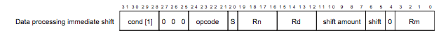


Task list to copy/paste when creating PR for this assign:

__Before releasing assign3:__
- [ ] Review writeup/starter code (instructor)
- [ ] Consider changes for clarity of spec/ease of grading (TA)
- [ ] Followup on any github issue from previous

__To prep for assign3:__
- [ ] 


*Written by Pat Hanrahan; updated by Julie Zelenski and Philip Levis*




## Goals

Libraries are critical in software development. They let you build
on existing, well-designed, and well-tested abstractions.
Many of the C standard libraries are
surprisingly large. Because we  copy our entire program over a slow
serial line to the bootloader, we want to have simpler versions of these libraries
that implement a limited subset of features.  

A library for outputting formatted text is particularly powerful,
since printing program state is a valuable form of debugging. In C, the
standard function for outputting formatted text is `printf`. The standard
C `printf` has many options and a large code size.  Our goal to build a complete system from the ground up, without relying on existing
libraries, means you'll be implementing a
pared-down `printf` that provides just the essential core functionality. Your `printf` will be layered on a `strings` module that you will also write.
Completing this assignment will give you two new modules to add to your growing library of Raspberry Pi functions. 

In addition to having an extremely useful library going forward, by implementing these
functions you'll learn:

- how to decompose a complex programming problem into smaller and easier pieces,
- how strings and characters are represented and manipulated in C,
- how to convert basic C types (numbers, pointers, ...) to a string representation,
- how to reuse your GPIO and timer code from the previous assignment, and
- how to use the UART library shown in class to communicate with your laptop.

## Advice

This is a difficult assignment, so...

  1. **Mindset**. Your skills with C pointers will grow leaps and bounds in completing this assignment, but there will be tricky code to wrestle and you're likely to encounter some tough bugs along the way. You can do this!  If you start to lose momentum, reach out for help and we can get you back on track.
  1. **Start early**. This gives you time to think things through, to take advantage of office hours, to take a break and clear your head when stalled, to back out from a decision that didn't work out, to stop and smell the roses and appreciate the process!  In contrast, starting at the last-minute means working non-stop under the unpleasant stress of a looming deadline.
  1. **Follow good development and debugging techniques**, just like you learned in lab. Dig in now to build up your mad gdb skills.
They will greatly help you complete the assignment faster. 
  1. **Test as you go**; spending 10 minutes to write a test
  can save you hours of debugging time later.
  1. **Commit your code to git often**, so that if you modify your code and break 
it you can easily go back to a working version. 

Implementing `printf` is a big job. It will be much more tractable if you break down the problem into smaller, more manageable tasks. Developing an appropriate decomposition and identifying a good path to follow from start to finish can be tricky, so this writeup guides you to strategies that we know work well. We include lots of suggestions for how to test your code along the way. 

We know this assignment is a big step up, and you will learn a tremendous amount in completing it. We have many quarters of experience helping students succeed on this assignment, and we know you can triumph! But please, please, please follow our recommendations so you can not only end with a satisfying result, but also have an enjoyable journey.

## Get started

__IMPORTANT__: Navigate to your copy of the `cs107e.github.io` repository and do a `git pull`
to ensure your courseware repo is up to date.  

As with previous assignments, we have created the assignment basic branch for you, so you just need
to fetch the latest copy of the remote repository and checkout the branch:

```
$ cd cs107e_home/assignments
$ git fetch origin
$ git checkout assign3-basic
```

The `assign3-basic` branch contains the `gpio.c`
and `timer.c` files from your last assignment (if you submitted an extension,
the files will be from your extension submission).  If you intend use this
code, read the `Makefile` for more information on how to reuse modules written
for previous assignments.

The starter code contains the modules `printf.c` and `strings.c` (mostly-empty
to start) and a sample application `apps/print_triangle.c` and the test program `tests/test_strings_printf.c`.

You will edit the `strings.c` and `printf.c` files to implement the required
functions.  You will also add many tests to `tests/test_strings_printf.c`.  The `apps/print_triangle.c` contains a tiny sample application. **Do not modify `apps/print_triangle.c`, as doing so means we can't be sure that your
assignment solution conforms to the required interface.**

## Basic section


### Strings module
Every general purpose programming language supports a string data type and operations. 
The string type in C is very bare bones; simply a pointer to a contiguous sequence of characters terminated by a null character (zero, or `'\0'`). You can access individual characters using pointer or array operations and that's about it. To do more useful things with a C-string, such as find its length, make a copy, or compare two strings, you will need additional functions. Use the command `man string` to list the functions from the standard C  `strings` module. There are a lot of functions in the standard library!

You will implement your own `strings` module for the Pi. The module will not include such a large number of operations, just a few key essentials chosen for their specific usefulness to us.

Each string function is a small task that can be implemented and tested independently. Together, they form a valuable library for string-handling. These functions will be particularly useful in writing `printf`, as well as generally handy in future endeavors.

The six string functions you are to implement in `strings.c` are:

- `memset`
- `memcpy`
- `strlen`
- `strcmp`
- `strlcat`
- `strtonum`

Review the [strings.h](https://github.com/cs107e/cs107e.github.io/blob/master/cs107e/include/strings.h) file to learn the operation of each
function.  Although our function interfaces are modeled after similarly-named functions in the
standard C library, we have made some simplifications, so please read our header file
carefully to ensure you are implementing only and exactly what is
expected!

The choice of these particular six functions may appear a bit eclectic, but each was selected for its utility in implementing and/or testing the `printf` module. As you implement each string function, be sure to consider how to properly use it and what it will be useful for. In particular, `strlcat` may seem somewhat oddly-structured at first glance, but its specific functionality turns out to be a great match for certain tasks within `printf`.

Do not move on from each function until you have thoroughly tested it. Add your tests to the program in `tests/test_strings_printf.c`. Use `make test` to build and run the test program. Read our [advice on testing](#testing)! Debugging a `printf` implemented on an unreliable/untested strings library is an arduous task, as you must debug all of the code simultaneously and untangle complex interactions. In contrast, implementing `printf` on top of
a robust strings library is much more straightforward. Because of your thorough testing, you can be confident that the strings library does its job correctly and focus your attention on debugging only the new code being added.

Congratulations on building another snazzy module to add your library! You can immediately put these functions to work in your `printf`.

### Printf module

The functions in the `printf` module produce formatted output. Each function accepts the same type of format strings with the same conversions, but differ slightly in how they are called or where the output is written.

Your code will be written in `printf.c`, and the header file
[printf.h](https://github.com/cs107e/cs107e.github.io/blob/master/cs107e/include/printf.h)
contains the documentation. The functions you will implement are:
- `printf`
- `snprintf`
- `vsnprintf`
- These two helper functions are not declared in the header file, but are expected to be part of your implementation:
  - `unsigned_to_base`
  - `signed_to_base`

We recommend that you start by implementing the two `xxx_to_base` helper functions, then move on to the meaty `snprintf`, then finish with  `vsnprintf` and `printf`. Read on for specific guidance on each task.


#### 1. Number to string conversion

 ```c
int unsigned_to_base(char *buf, size_t bufsize, unsigned int val, int base, int min_width);
int signed_to_base(char *buf, size_t bufsize, int val, int base, int min_width);
 ```

These helper functions convert a number to a string representation,
for example, converting the number `0x6b` to the string `"107"`.

The caller passes the arguments `buf` and  `bufsize`. `buf` points to a character array where 
the function should write the string. `bufsize` is the size of this array.  Your functions should never write past the end
of `buf`. If the output does not fit, truncate it. Don't forget that you also need
space for a null terminator.

The `val` argument is the integer value to be converted to a string.
If `signed_to_base` is called with a negative value, the output string will contain a leading minus sign.

The `base` argument indicates which base the string is to be written in. You must support
decimal (base 10) and hexadecimal (base 16). Do
not copy/paste to create two nearly identical conversion functions, one for each base! Repeated code means more code to write, debug, test, and maintain; a lose-lose all around.
Instead, identify how to unify into a single implementation that flexibly allows for 
either base. Similarly, although there is both a signed and unsigned conversion function, 
you should also not duplicate code between the two. Instead consider how you can call 
the `unsigned` function from the `signed` function.

The `min_width` is the minimum number of characters in the output string.  If 
the formatted string is less than `min_width`, pad the
beginning of the string with zeros so it has length `min_width`. If the 
formatted string is already at least as long as `min_width`, ignore the `min_width`
argument. The minus sign should precede the zero padding and is included
in the `min_width`. You can assume `min_width` is non-negative.

The string written into `buf` must be a valid, null-terminated C-string. 

These functions return the count of characters written to
`buf` if there is space to fit the entire formatted string. If not, it should return
the count of characters that would have been written if there
were space. The null terminator is not included in the count. 

Some examples (`'\0'` is the null terminator):

  * `signed_to_base(buf, 20, 94305, 10, 0)` writes 6 bytes into `buf`: `"94305\0"` and returns 5.
  * `unsigned_to_base(buf, 20, 33, 16, 3)` writes 4 bytes into `buf`: `"021\0"` and returns 3.
  * `signed_to_base(buf, 5, -9999, 10, 6)` writes 5 bytes into `buf`: `"-099\0"` and returns 6.

**Note about bufsize and memory corruption:**
You might notice that some of these parameters overlap in what they specify about
the output string. For example, `bufsize` is a hard upper limit on how much space is 
available to store the output string, but nothing in the calling convention says that
`min_width` must fit within `bufsize`. In all cases `bufsize` wins: not writing beyond the end
of `buf` and not corrupting memory is more important than writing out the string specified
by the arguments.  If `bufsize` is too small to fit your output, even if `min_width` says you 
should go past it, you must truncate the output and store a null terminator in `buf[bufsize - 1]`. 
Finally, `bufsize` can be zero: if so, you should not write anything to `buf`, not even a 
null terminator.

__Test as you go!__
Remember that it is easier to debug small steps than large changes,
so make sure these helper functions are working before you move on. There are many 
different cases to cover for all of the printf functions, you will need to add many tests into `tests/test_strings_printf.c` to achieve the necessary comprehensive coverage.

#### 2. Implement `snprintf` 


```c
int snprintf(char *buf, size_t bufsize, const char *format, ... );
```

The `printf` family of functions use what are called "formatting strings" that combine different kinds of values into a single string. Review this [C reference](http://www.cplusplus.com/reference/cstdio/printf/#example) for sample uses of  `printf`. The default `printf` writes the formatted output to your terminal; the `snprintf` variant writes the formatted output to a string buffer. 

Full documentation for a standard C function is available in its man page, e.g. `man snprintf`. Bear in mind that your implementation supports a more limited set of options than the full-featured standard library version. Refer to our 
[printf.h](https://github.com/cs107e/cs107e.github.io/blob/master/cs107e/include/printf.h) header file to know exactly what your version is required to support.

A formatting code has the form of `%z`, where `z` is a character that specifies
the output format.  Your implementation must support these formatting codes:

```
 %c   single character
 %s   string
 %d   signed decimal integer
 %x   unsigned hexadecimal integer
 %p   pointer
 %%   output a percent sign
```

Each formatting code in the format string is paired with an argument passed to `printf`. The first
formatting code is paired with the argument following the formatting string, the second code is paired with the subsequent argument, and so on.

The strategy for `snprintf` is to traverse the characters in the format string, handling each one by one. It copies each ordinary character unchanged to the output string. When it encounters the `%` that indicates the start of a formatting code, it does the appropriate conversion of the associated argument to string form. No actual processing is needed to "convert" characters and strings, so those are straightforward: copy the character or string argument to the output string. To convert an integer to a string, use your handy `unsigned_to_base` and 
`signed_to_base` helper functions. A pointer is just a special kind of integer (details below).

The integer formatting codes (`%d` and `%x`) allow an optional
width, such as `%03d` or `%05x`. The width specifies the minimum number of characters in the converted string. The width is a non-negative decimal number and must be specified with a leading 0.

For example, `"%014x"` outputs its unsigned integer argument as a hexadecimal string of at least 14 characters (padded with zeros on the left as necessary). The width option is only supported for formatting codes `%d` and `%x`.

The `%p` format outputs an address as a width-8 hexadecimal string prefixed with 0x, e.g. `0x20200004`. Think about how you can reuse your integer conversion functions to implement this 
easily and simply.

The `snprintf` function takes a variable number of arguments, one argument for each formatting code in the format string. To access those additional arguments, you use C's `<stdarg.h.>` interface. Read more about [Variadic functions](#varargs) further down in this writeup.

The return value from `snprintf` is the number
of characters written if they fit in `buf` or the number of characters
that would have been written if there were space. Again, `bufsize` is the size that you're allowed to write to, and you must
null-terminate your output.

For simplicity, you can assume that you will never output a string of length greater than 1024 characters (regardless of the size of the destination buffer). If you allocate a temporary buffer of the maximum size and write the full string into it, you can then copy what fits into the final destination as a way to neatly handle the truncation case.

Trying to implement all of the functionality in `snprintf` in one go is extremely difficult. It will
quickly lead to a mess of complicated code that is hard to debug or get right. It is
much easier if you break it down into smaller problems, which you solve one by one. Implement and test each part as you add it. Add your tests into `tests/test_strings_printf.c`. Build and re-run after each additional test or change in functionality.

Plot out a path that decomposes the problem into small, manageable steps. For example, you can start by
implementing `snprintf` that does not support any formatting codes, just outputs the ordinary characters. You can test it with simple examples such as `snprintf(buf, BUF_SIZE, "Hello, World!")`. 
Next, add formatting codes one by one. Which formatting code is easiest to start with? 

Getting a working `snprintf` is the big hill to get over in this assignment. Once you have that, finishing the rest is a set of simple layers. This means you are now in the homestretch -- congratulations!

#### 3. Refactor into `vsnprintf`

```c
int vsnprintf(char *buf, size_t bufsize, const char *format, va_list args);
```

The `printf` function needs the same functionality as `snprintf`. However 
since `snprintf` takes a variable number of arguments, you cannot call it directly 
from `printf`.  You must create a shared helper function `vsnprintf` (that takes a
`va_list` parameter), which you can then call from both `snprintf` and `printf`.
Refactoring means moving most of your `snprintf` code into `vsnprintf` and then changing `snprintf` to call `vsnprintf`. Once you have completed this refactor, confirm you are still passing all of your previous tests.

#### 4. Implement `printf`
Finishing off `printf` is now a piece of cake. All the function needs to do is declare a stack array of the maximum output length (1024), call  `vsnprintf` to write the formatted string into the array, and call `uart_putchar` to output each character.

```c
int printf(char *format, ... );
```

Having thoroughly tested `snprintf`/`vsnprintf`, you will not likely need many new tests for `printf`, since it is built on the same substrate that you have already confirmed correct.

It is time 🕰 for a serious Happy Dance 🙌 You did it! 🏆 You can now enjoy the fruit 🍎 of your labors 💪 for a long time to come!

<a name="varargs"></a>
## Variadic functions 

`printf` and `snprintf` are functions that take a variable number of arguments.
C has standardized the way to access variadic functions using the `stdarg.h` interface.
Here is an example.

```c
#include <stdarg.h>
#include <stdio.h>

int sum(int n, ...)
{
    int result = 0;
    va_list ap;

    va_start(ap, n);
    for (int i= 0; i < n; i++)
        result += va_arg(ap, int);
    va_end(ap);

    return result;
}

int main(void)
{
    printf("%d\n", sum(4, 100, 0, 5, 2) );
    printf("%d\n", sum(2, -1, 1));
    return 0;
}
```

The function `sum` has one fixed argument `n`, followed by some number of
additional arguments, indicated by the `...` in its parameter list.  In
general, variable-argument functions still require at least one fixed argument.
For example, the call `sum(4, 100, 0, 5, 2)` contains one fixed argument, 4
(number of values to sum), and four additional arguments, 100, 0, 5, and 2.

The implementation of the  `sum` function demonstrates how to use `stdarg.h`. 

The variable `ap` is declared of type `va_list`.  This variable is initialized
using `va_start`, which is passed the last named argument. In this case, we
tell `va_start` that `n` is the last argument before the variable arguments
begin.

Then we loop over the `n` arguments, fetching each argument using `va_arg(ap,
type)`. In the `sum` example, the variable arguments are all of `int` type, but
the type can be different per-argument by changing what type is used in
`va_arg`. When we are done processing all of the variable arguments, we call
`va_end(ap)` to clean up after ourselves.

Note that because of obscure rules in the C standard about "[default argument
promotions](http://stackoverflow.com/questions/1255775/default-argument-promotions-in-c-function-calls)",
you cannot ask `va_arg` for the `char` type. Instead you must ask it for an
`int` and then cast the `int` to a `char`.

For additional information about `stdarg`, read the [Wikipedia page on
stdarg.h](http://en.wikipedia.org/wiki/Stdarg.h).

<a name="testing"></a>
## Testing, testing testing! 
Students who struggled in the past generally wrote too much code
before testing it. We recommend that you instead approach the work by dividing in tiny
increments, making a small, testable improvement each time. If it
doesn't work, you'll know exactly where to look for the mistake. This strategy will save you a lot of time and heartache.  To quote Dawson Engler, Systems Programmer Extraordinaire:

> Engler’s theorem of __epsilon-steps__: 
> Given a working system _W_ and a change _c_,  as _c_ → ε  the time _T_ it takes to figure out why _W_ + _c_ doesn’t work goes to 0 (_T_ → 0).

After taking each epsilon-step in your code, immediately turn your attention to testing and debugging it. What test case can you add to `tests/test_strings_printf.c` to confirm that the code you just added is working correctly? It may require multiple test cases to get at different parts of the behavior. Add those tests now and don't move on until you pass them all.

Never delete a test! Sometimes a later change will cause a test that was previously passing to backslide. If you have removed or commented out the test, you won't realize the bug has resurfaced. Instead, accumulate all tests in `tests/test_strings_printf.c` and keep them active. Every subsequent run will re-validate against the entire test suite and alert you to any regression.

Review the function specifications in the `strings.h` and `printf.h` header files and be sure that your test cases have full coverage of the specified behavior, including any edge cases or required error handling. If your testing gets there ahead of the autograder, you can find and fix your bugs before submitting to its rigorous scrutiny.

In `tests/test_strings_printf.c`, we hope to see a comprehensive test suite that exercises each function in the strings module and all formatting options mix-and-match for printf and variants. There is a lot of ground to cover! Grading will include an evaluation of the effectiveness of your tests, along with our feedback to help you to develop and refine this critical skill.

Note that our module interfaces include some simplifying assumptions and restrictions on what constitutes valid calls: e.g. exactly and only these formatting codes, base is always be 10 or 16, the width specified must begin with a zero, the width will never be negative, the format string is well-formed and so on. You do not have to detect/handle/reject calls that violate these assumptions, we will not test on such inputs and your tests do not need to consider these cases.

## Debugging
One unfortunate circularity with trying to test printf is the
lack of a working printf to help you debug.  Here are a couple of strategies you may want to consider:

- Run your program under gdb in simulation mode and use gdb commands to
    step and print variables to observe your program's operation. We strongly encourage you to invest in building up your gdb chops now -- this investment will really pay off! We added a new target to the Makefile `make debug` that builds your test program and sends you straight into gdb. We encourage you to use it early and often. Be mindful of the differences between the simulator and the actual Pi. (review exercise 4d of [Lab3](/labs/lab3/#4d-differences-under-simulation) if you need a refresher)
- Liberal use of `assert()` tests. For example, you might test the output
  written by `signed_to_base` matches the expected output by asserting the two
  strings `strcmp` as equal. 
- A somewhat more complicated arrangement is to debug using our `printf` from `libpi.a` You can use ours `printf` in conjunction with yours if you first disambiguate the names. Here's how:
    - Rename all of your functions in `printf.c` to add `my_` prefix, e.g. `my_printf` and `my_signed_to_base`. 
    - Change all references throughout your code to match your renamed functions (e.g.  `my_printf` calls `my_vsnprintf` and so on). 
    - After renaming your versions, you can now use `printf` to access to the libpi version. For example, in `tests/test_strings_printf.c` you call `my_printf` to test your function, and within your `my_printf` implementation, you might call `printf` to output internal values
for debugging. 
**WARNING:** Our implementation of `printf` will call on __your__ string functions in `strings.c`. You should be certain that your implementations are well tested for this path to work.
</div>

## Extension: disassembler
The extension for this assignment is to put your shiny new `printf` to work in writing a program that can disassemble itself. The binary-encoded instructions for the currently executing program are stored in memory starting at address `0x8000`. Each instruction is encoded as an unsigned int. Here is a diagram of the bitwise breakdown for a data processing instruction:



Reading from left to right, the upper four `cond` bits indicate conditional execution, the next three bits are `000` indicate this is a data processing instruction with an immediate operand 2, the four `opcode` bits determine which kind of operation (add, subtract, etc), the `S` bit determines whether the flags are set, and so on. 

In class, Pat asked you to play the role of _assembler_ by translating an instruction such as  `add r3, r4, r5` into `e0843005`. The reverse process is a _disassembler_ which picks apart the bits of the encoded instruction `e0843005` to print out `add r3, r4, r5`.  The extension is to automate this disassembly process and produce output like that shown below:

    ...
    0x00008074: e0 43 30 05    add r3, r4, r5
    0x00008078: eb 00 01 c9    bl 87a4
    ...

You _could_ use your bit-masking superpowers to pick apart an encoded instruction but a simpler way is to define a C bitfield. Open the file `disassemble.c` given in the starter code to see an example.

Your extension should be capable of decoding the most common variants of the data processing and branch instructions. The ARM instruction set has a remarkably regular encoding, so you can catch a good chunk of all instructions with just a few cases. If you want to get fancier, try decoding load/store and load/store multiple (i.e. push and pop).

Refer to the [ARM ISA documentation](http://cs107e.github.io/readings/armisa.pdf) for details on the instruction encodings. Another useful resource is this [ARM guide from USCD](https://cseweb.ucsd.edu/~ricko/CSE30/ARM_Translation_Guide.pdf) which breaks down the bits in the encoding. 

Don't worry about making special cases for oddballs. For any instructions you don't decode, print the encoded value and skip to the next. 

Print the sequence of disassembled instructions starting from address `0x8000` and continuing for 100 instructions or so.  Some of the data you encounter may not be instructions at all (e.g. data values can be intermixed into the instructions). Don't worry about those, just decode the first 100 4-byte values as though each was an instruction. 

Compare your output to the contents of `disassemble.bin.list` (this is the disassembly produced by `objdump`) to see how good a job your disassembler is doing.

Create an assign3-extension branch for your work on the extension and make a separate pull request to submit it for grading.

You just wrote a program that dissects itself from the inside -- how awesome is that! We will offer more credit on this extension as it is a bit harder than the previous one; a great implementation deserves to be appropriately awarded!🎖

## Submit and automated checks
Submit the finished version of your assignment by making a git “pull request”.
The deliverables for `assign3-basic` are:

+ implementation of the `strings.c` and `printf.c` modules
+ your comprehensive tests for all strings and printf functions in `tests/test_strings_printf.c`

The automated checks here make sure that we can build your C
code and will be able to properly test and grade it, including swapping your tests for ours.

CI verifies that:

- `apps/print_triangle.c` is unchanged

- `make` completes successfully

- `make test` completes successfully using your `tests/test_strings_printf.c`

- `make test` completes successfully using the original `tests/test_strings_printf.c` from
  the starter code (we will swap this in before running it)

Again, if CI fails on your final submission, we will automatically
deduct 1 point from your basic grade. Also remember that the automated tester will deduct half a point for any
warnings generated when compiling your code. 
