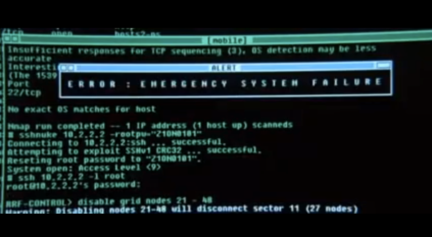
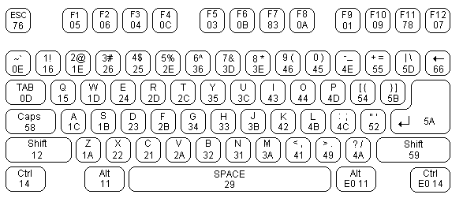


Task list to copy/paste when creating PR for this assign:

__Before releasing assign5:__
- [ ] Review writeup/starter code (instructor)
- [ ] Consider changes for clarity of spec/ease of grading (TA)
- [ ] Followup on any github issue from previous

__To prep for assign5:__
- [ ] 




*Written by Philip Levis, updated by Julie Zelenski*





In this assignment, you'll implement a PS/2 keyboard driver and a simple command shell. This is a fun assignment, and brings us back to using physical devices and making them do cool things. These additions are the first steps toward turning your humble little Raspberry Pi into a standalone personal computer.


## Goals

In this assignment, you will

1.  Build on your scancode reader from Lab 5 to write a keyboard driver
    that correctly translates PS/2 scancodes into ASCII characters.
2.  Connect your keyboard driver to the serial port so that you
    see what you type.
3.  Write a simple shell that reads and executes commands.

## Get started

Navigate to your copy of the `cs107e.github.io` courseware repository and do a `git pull` to update to the latest files.

As usual, we have created your `assign5-basic` branch. Navigate to your `assignments` directory and check out the new branch.

```
$ cd cs107e_home/assignments
$ git fetch origin
$ git checkout assign5-basic
```

Read the `Makefile` for information on how to reuse the modules you have written for previous assignments. 

If reusing your code, verify that your project has up-to-date versions of
your modules `gpio.c`, `timer.c`, `strings.c`, `printf.c`, `backtrace.c` and `malloc.c`.  If you are missing updates made on a different branch, use `git merge` to incorporate those changes. For example, if you made a regrade submission on `assign3-basic` and want to add those changes into `assign5-basic`, have `assign5-basic` checked out and use `git merge assign3-basic`.

The starter project contains the module files `keyboard.c` and `shell.c`, the application program `apps/uart_shell.c` and the test program `tests/test_keyboard.c`. You will edit `keyboard.c` and `shell.c` to implement the required functions. You can add tests to `tests/test_keyboard.c`. The program `apps/uart_shell.c` is used unchanged as a sample application.


## Basic part

### Keyboard driver

The  `keyboard` library module you are to implement this week provides a driver for a PS/2 keyboard. The header file
[keyboard.h](https://github.com/cs107e/cs107e.github.io/blob/master/cs107e/include/keyboard.h) documents the routines exported by the module, which are:

+ `keyboard_read_scancode`
+ `keyboard_read_sequence`
+ `keyboard_read_event`
+ `keyboard_read_next`

You'll start by implementing the low level routines that read raw scancodes and then add the mid and top level routines that translate from scancodes into key events and typed characters.

#### 1) Read and validate scancodes

The first two functions you will implement for the keyboard module are the low-level routines that deal with nitty-gritty of the PS2/2 protocol. 

Recall from lab that a PS/2 scancode is an 8-odd-1 packet
consisting of 11 bits. The first bit, the start bit, is low. The next 8
bits are data bits, least significant bit first. The tenth bit is a parity
bit. The PS/2 protocol uses odd parity, which means that there should be an odd number of 1s in sum of the data and parity bits. The 11th and final bit is the stop bit, which is
always high.


Copy your implementation of `keyboard_read_scancode` from lab5 into `keyboard.c`,
then extend the function to verify the validity of the parity and stop bits. If either the parity bit
or stop bit is incorrect, discard the scancode and try again.

`keyboard_read_scancode` should not return 0 on
failure: instead, it should retry reading a new scancode from the beginning.  It is important to recovery gracefully from transmission errors. Discard as many invalid tries as necessary until you receive a valid scancode.



**Timing is everything!**: The timing of the PS/2 protocol has to be strictly followed. The keyboard sends the bits rapid-fire and you must catch each bit as it arrives. Once your driver sees the falling clock edge for the start bit, it needs to stay on task to read each subsequent bit.  There is not time between clock edges to complete a call to a complex function like printf.  Save any debug printing for after you read the entire sequence.
</div>

In a similar vein, a dropped bit or partially read and discarded scancode could lead to your driver becoming desynchronized.  When
this happens, your driver may try to read a scancode byte starting in the middle
of a bit sequence and will expect further bits to arrive that won't be forthcoming. One way to recover rather than get stuck there to have `keyboard_read_scancode` *time-out*. Use
your timer code to detect if the current falling clock edge occurred more than
3ms after the previous one, and if so, reset the state and
assume the current clock edge is for a start bit. This behavior is a small effort that adds a nice bit of robustness.

The first test in `tests/test_keyboard.c`  will read and echo scancodes. Use this test to verify your basic scancode functionality.

#### 2) Process a key sequence

The next layer in the keyboard driver is a function that reads a sequence of scancodes and processes into a key action.  A key action is the press or release of a single key.

When you press a key, the PS/2 keyboard sends the single scancode for that key. When you release
the key, it sends a two-byte sequence: `0xF0` (the "break" code) followed by the key's scancode. For example, typing `z` will cause the keyboard to send `0x1A` and releasing `z` will
cause the keyboard to send `0xF0`, `0x1A`.

The press or release of an extended key sends a sequence with the extra byte `0xE0` inserted at the front. For example, pressing the right Control key sends the sequence
`0xE0`, `0x14` and releasing sends `0xE0`, `0xF0`, `0x14`.

The `keyboard_read_sequence` function reads the raw sequence of scancodes (1, 2 or 3 bytes depending on context) and translates it into a `key_action_t` struct which reports the type of action (press or release) and which key was involved.

Implement `keyboard_read_sequence()` in `keyboard.c`. Use the test program `tests/test_keyboard.c` to verify the operation of the function.

#### 3) Process keyboard events
The mid-level routine of keyboard driver returns key events. It obtains a `key_action_t` from `keyboard_read_sequence` and forms a  `key_event_t` struct. The struct fields include the key action that generated the event, the PS2 key entry corresponding to the key acted upon, and the current state of the modifier keys.

The `enum keyboard_modifiers` assigns a bit to each
modifier key.  If a certain bit is set in `modifiers`, that indicates the corresponding modifier key is currently held down,
or, in the case of `CAPS_LOCK`, is in the active state.
The function `keyboard_read_event` must track the state of the current modifiers and update it on each modifier key action.

You will need a _lookup table_ to map a key from its PS/2 scancode to the characters it produces when typed. Our provided [ps2.h](https://github.com/cs107e/cs107e.github.io/blob/master/cs107e/include/ps2.h) interface declares an array of `ps2_key_t` structs.  The array is indexed by scancode.

A `ps2_key_t` entry has two character values, 
the unmodified character and the modified character.
For example, pressing the A key generates scancode `0x1C`. The 
array element `ps2_keys[0x1C]` is set to `{ 'a', 'A' }`, the two characters this key produces. 
The two characters for the Zero key are `{ '0', '!' }`. Characters that do not produce a different character when modified have a 0 in the second slot, such as `{'\t', 0}` for the tab key.
Non-character keys, such as the Escape or Backspace key, are assigned character values greater than 0x90 to distinguish them from ASCII characters. 

 The source file
 [ps2.c](https://github.com/cs107e/cs107e.github.io/blob/master/cs107e/src/ps2.c) contains the definition of the `ps2_keys` array. 
Note that some scancodes do not correspond to keys at all;
those entries are indicated by a special struct `UNUSED`.

Additionally the file `ps2.h` defines various useful constants 
such as `PS2_CODE_RELEASE = 0xF0`, and `PS2_CODE_EXTENDED = 0xE0` and codes for the modifier keys such as `PS2_KEY_SHIFT`.

Use the functions in `test/test_keyboard.c` to verify your processing of key events before moving on.

#### 4)  Produce ASCII characters

You now have all of the pieces you need to implement the final top-level routine `keyboard_read_next`.  This function returns characters as typed by the user. The return value is an ASCII character in the case of an ordinary key (potentially affected by the current state of modifiers) or the designated code from `ps2.h` for a special key such as ESC or F9. 



Your driver should handle all the keys shown in the keyboard diagram above. Specifically this means:
- all letter, digit, and punctuation keys
- whitespace keys (Space, Tab, Return)
- Escape and Function keys F1-F12
- Backspace key (sometimes marked with ← or ⌫)
- Modifier keys: Shift, Control, Alt, Caps Lock

You'll need to implement Shift and Caps Lock.
It turns out that Windows/Linux handle it differently than a Macintosh.
Your code should follow the Macintosh behavior,
since it's better to rely on Apple for better user interface design.
If you are using a Mac, try the Keyboard Viewer to see which character is generated for a given key combination. (Keyboard Viewer is in the menu bar if enabled in System Preferences -> Keyboard -> Show Keyboard Viewer).
If you're are still unsure how to handle different cases,
try our reference implementation of the keyboard
using the test application from lab.


### Shell application
Your keyboard driver can be used in a simple shell application program that allows you to type in commands and control the Pi without needing to plug another computer into it. A shell, such as `bash` or `zsh`, is a program that serves as a command-line interpreter. The program sits in a loop, reading a command from the user and then executing it. 


#### 1) Review shell interface and starter code

Review the interface to the `shell` module in the header file
[shell.h](https://github.com/cs107e/cs107e.github.io/blob/master/cs107e/include/shell.h).
 
One noteworthy detail of the shell's interface is how it provides flexibility in the output device. The `shell_init` function takes a _function pointer_ argument that controls where the shell directs its output. The shell can be reconfigured for different outputs by supplying a different print function.

The `apps/uart_shell.c` application program calls `shell_init(printf)`.  This configures the shell to call your `printf` function to send output to the serial uart interface.
In assignment 6, you'll write a `console_printf` function that draws to a HDMI monitor. If you configure the shell using `shell_init(console_printf)`, it will display its output on the graphical console.

Whenever your shell needs to display output, it must call the print function passed to `shell_init`.  This applies to all output from the shell, whether it be the shell prompt, displaying the result from a command, or responding with an error message to an invalid request.  Your shell should NOT make any direct calls to `printf` or `uart_putchar`. (The one exception is in the given `shell_bell` that generates a beep over the uart.)

The given starter code for the `shell_run` function demonstrates the standard read-eval-print loop that is at the heart of an interpreter. Here is that loop expressed in pseudocode:

    loop forever
        display prompt
        read line of input from user
        evaluate command (parse and execute)

#### 2)  Read line

`shell_readline` reads a single line of input from the user. It reads the characters typed on the keyboard and stores them into a buffer. The user indicates the end of the line by typing Return (`\n`).

When the user types Backspace (`\b`), the shell should remove the last
character on the current line.  Outputting a backspace character, e.g. `uart_putchar('\b')` , will move the cursor backwards one position. If you back up, output a space, and then back up again, you will have effectively "erased" a character. (Wacky, but it works!) 

If the line is empty and the user types Backspace, use the provided `shell_bell` function to beep instead of attempting to remove a non-existent character.

`shell_readline` is a great way to exercise your shiny new keyboard driver!

#### 3) Parse command line

When a user ends the line by entering Return, use `shell_evaluate` to parse the current line as
follows:

+ If the line is empty, skip it, there is nothing to evaluate.
+ Otherwise, tokenize the line into words. A token consists of a sequence of non-space characters. Store the tokens into an array of `char *`. The first token is the name of the command to execute, the subsequent tokens are the arguments to the command.
+ Look up the command function associated with the command name (first token). This lookup uses a "command table" that is described in the section below.
+ If no matching command is found, print an error message `error: no such command 'binky'.`
+ Otherwise, execute the function associated with the command, passing the rest of the tokens as arguments.

We've implemented the `echo` command for you. `echo` simply prints out all
of its arguments. For instance, when a user types `echo Hello, world!` in
the shell, the shell responds with: `Hello, world!`. The session should
    look as follows once you've successfully implemented this tiny shell:

        Pi> echo Hello, world!
        Hello, world!

Be sure to take advantage of the awesome functions you have implemented in your `strings` and `malloc` modules. They will be very helpful here!

Because trying to debug the code that parses a line text into an
array of strings is a bit harder on your Raspberry Pi than on your
laptop, you might want to first write and debug it locally, or use
the ARM simulator in gdb.

#### 4)  Execute command
The 
[shell_commands.h](https://github.com/cs107e/cs107e.github.io/blob/master/cs107e/include/shell_commands.h) file defines a struct to represent a shell command. The `fn` field is a pointer to a function that takes two arguments: `argv` is an array of `char *`, i.e. an array of strings, and `argc` is the count of elements in the  `argv` array. A command function returns an int to indicate success or failure. The result is 0 if the command executed successfully, or nonzero otherwise. There's a starter table of commands in `shell.c` called `commands`. You should modify this table as you add commands to your shell.

Here are the commands you are to implement:

+ **help**

    Without any arguments, `help` should print a list of all available commands
    along with their description in the following format:

        Pi> help
        cmd1: description
        cmd2: description

    If an argument is given, `help` should print the description for that command,
    or an error message if the command doesn't exist:

        Pi> help reboot
        reboot:  reboot the Raspberry Pi back to the bootloader
        Pi> help please
        error: no such command `please`.

+ **reboot**

    This command should reboot your Pi by calling the `pi_reboot` function from the `pi` module of `libpi`. See ya back at the bootloader!

+ **peek**

    This command takes one argument: `[address]`.  It prints the 4-byte value stored at memory address `address`. 

    Example (assume address 0xFFFC contains the number 0x12345678):

        Pi> peek 0xFFFC
        0x0000fffc:  12345678

    Remember that the strings modules you wrote early contains the handy function `strtonum` to convert strings to numbers. If the address argument is missing or cannot be converted, `peek` should print an error message:

        Pi> peek
        error: peek expects 1 argument [address]
        Pi> peek bob
        error: peek cannot convert 'bob'

    Remember that the ARM architecture is not keen to load/store on an unaligned address. A 4-byte value can only be read starting from an address that is a multiple of 4. If the user asks to peek (or poke) at an unaligned address, respond with an error message:

        Pi> peek 7
        error: peek address must be 4-byte aligned

+ **poke**

    This command takes two arguments: `[address] [value]`.  The poke function stores `value` into the memory at `address`.

    Example (assume 0xFFFC currently contains the number 0x12345678):

        Pi> peek 0xFFFC
        0x0000fffc:  123456789
        Pi> poke 0xFFFC 1
        Pi> peek 0xFFFC
        0x0000fffc:  00000001
        Pi> poke 0xFFFC 0
        Pi> peek 0xFFFC
        0x0000fffc:  00000000

    You should use `strtonum` to implement this command as well.  If either argument is missing or cannot be converted, `poke` should print an error message:

        Pi> poke 0xFFFC
        error: poke expects 2 arguments [address] [value]
        Pi> poke fred 5
        error: poke cannot convert 'fred'
        Pi> poke 0xFFFC wilma
        error: poke cannot convert 'wilma'

    Once you've implemented `poke`, you should be able to turn a GPIO
    pin on and off just by entering commands!

        Pi> poke 0x20200010 0x200000
        Pi> poke 0x20200020 0x8000
        Pi> poke 0x2020002C 0x8000

    Recall the
    [BCM2835 manual](http://cs107e.github.io/readings/BCM2835-ARM-Peripherals.pdf#page=90)
    and what is stored at the above three addresses. What should these
    commands do? Hint: the ACT LED on the Pi
    is GPIO pin 47. Another hint: see what the second value (the
    32-bit constant we want to store) looks like in binary in each case.

    Check out the
    [Wikipedia article on peek and poke](https://en.wikipedia.org/wiki/PEEK_and_POKE) if you're curious.

## Testing and debugging
As usual, the effort you put into writing good tests will be evaluated along with your code submission. An interactive program such as this one adds new challenges for testing. Your inventive solutions to overcoming these challenges are welcome!

The given code in `tests/test_keyboard.c` program has functions that test each layer of the keyboard module. These functions simply echo the data returned by the keyboard module. You must manually verify the correctness of the output. 

The `test_keyboard_assert` function demonstrates a possible approach for assert-based tests where you coordinate with the user to provide the keyboard input.

The `shell` module is intended to be run interactively and does not lend itself well to assert-based testing. This doesn't mean you should eschew testing it, but you will have to be more creative in how you proceed. A former student set up an array of commands to be used as a test script and then fed each line to `shell_evaluate()` in sequence and verified that the output was as expected, which I thought was pretty clever.

The `shell_readline` function is a particularly sticky one. Given that the simulator does not emulate the peripherals, debugging code that requires keyboard input under gdb is a no-go. Extending from the student's command script idea mentioned above, you could have a string of characters to force feed into `shell_readline` and instead of calling `keyboard_read_next`, you take the next char from your test string.

## Extension: editing and history

Create an `assign5-extension` branch for this part of the work and make a separate pull request from your basic submission.

The extension consists of two parts. You should do both parts.

1.  **Command-line editing**

    Implement the left and right arrow keys to move the cursor within the current line and allow inserting and deleting characters at the point of the cursor. What other editing features might be nice to have:  Ctrl-a and Ctrl-e to move the cursor to the first and last character of the line? Ctrl-u to delete the entire line? Implement your favorite vim/emacs/editor must-haves!

2. **Command history**

    Number the commands entered starting from 1 and maintain a rolling history of the last 10 commands entered. Change the prompt to include the command number of the current line. Add a `history` command that displays the history of recent commands, each prefixed with its command number. See the example below:

        [1] Pi> help echo
        echo: <...> echo user input to the screen
        [2] Pi> echo cs107e rocks
        cs107e rocks
        [3] Pi> history
          1 help echo
          2 echo cs107e rocks
          3 history

    Implement the up and down arrow keys to access commands from the history. Typing the up arrow key should change the current line to display the command from the history that is previous to the one on the current line. Typing a down array should change the current line to display the command that ran _after_ the one on the current line, or whatever the user had typed until he/she typed up. Use the `shell_beep` when the user tries to move beyond either end of the history.

    What other history features might be handy? `!!` to repeat the last command? `!ze` to repeat the most recent command matching the specified prefix `ze`?

    If you didn't already know that your regular shell includes editing and history features like these, now is a great time to pick up a few new tricks to help boost your productivity!

If you wrote the disassemble extension for assign3 (or you want to do it now!), a super-neat option would be to integrate a  `disassemble [addr]`  command into your shell. The fun never stops!


## Submit and automated checks

Submit the finished version of your assignment by making a git “pull request”.

The deliverables for assign5-basic are:

- Implementation of the `keyboard.c` and `shell.c` modules
- Your comprehensive keyboard tests in `tests/test_keyboard.c`

The automated checks make sure that we can run your C code and test and grade it properly, including swapping your tests for ours.

CI verifies that:

- `apps/uart_shell.c` is unchanged
- `make` completes successfully
- `make test` completes successfully using your `tests/test_keyboard.c`
- `make test` completes successfully using the original `tests/test_keyboard.c` from the starter code (we will swap this in before running it)

If the automated test fails on your final submission, we will automatically deduct 1 point from your basic grade. Also remember that we will deduct half a point for any compiler warnings that are generated when compiling your code.
