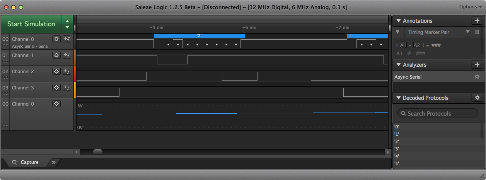
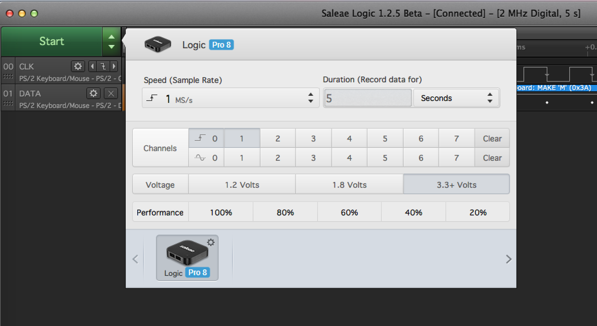
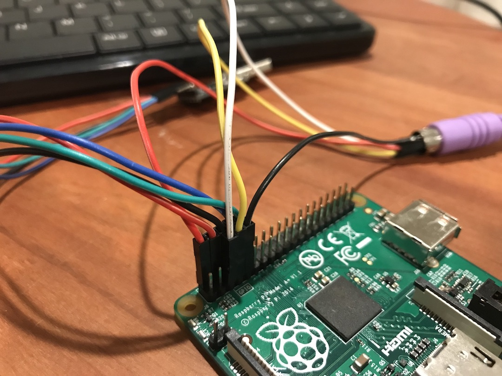


Task list to copy/paste when creating PR for this lab:

__Before releasing lab5:__
- [ ] Review writeup/code/checkin questions (instructor)
- [ ] Walk through (SL)
- [ ] Followup on any github issue from previous

__To prep for lab5:__
- [ ] Confirm there are sufficient number of working PS/2 keyboards to check out one to each student (Label keyboard with number to help track? )
- [ ] Confirm there are 4-6 Saleae logic analyzers in lab cabinet
- [ ] Print copies of PS/2 key code chart?



*Lab written by Philip Levis, updated by Pat Hanrahan*

## Learning goals

In your next assignment, you will read PS/2 scancodes from a keyboard and turn
them into ASCII characters. This will allow you to type text to
your Raspberry Pi. The goal of this lab is to set up the
keyboard so that you can immediately start on the assignment.

During this lab you will:

1. Install jumpers into PS/2 keyboard mini-DIN connector.
2. Watch the signals from the keyboard using a logic analyzer.
3. Print out the scancodes sent by the keyboard.
4. Write code to decode the PS/2 protocol to produce scancodes.

## Prelab preparation
To prepare for lab, do the following: 

- Pull the latest version of the `cs107e.github.io` repository.
- Clone the lab repository
   `https://github.com/cs107e/lab5`.
- [Download and install the *Logic* application from the Saleae
  web site.](https://www.saleae.com/downloads) This application will visualize the signals captured by the logic analyzer.
  You may also want to download the 
  [user manual](http://downloads.saleae.com/Saleae+Users+Guide.pdf).

## Lab exercises

Pull up the [check in questions](checkin) so you have it open as you go.

### 1. Add a PS/2 port to your Pi (20 min)

Most modern keyboards are USB keyboards.  Unfortunately, the USB
protocol is complicated; it's approximately 2,000 lines of code to
interface a USB keyboard to the Raspberry Pi.  Instead, we will
interface with a PS/2 keyboard, which uses a simple serial protocol
that is easy to decode.  The PS/2 keyboard appeared on the original
IBM PC.

There are two common PS/2 devices: a keyboard and a mouse.  PS/2
devices connect to a PC using a 6-pin
[mini-DIN connector](https://en.wikipedia.org/wiki/Mini-DIN_connector).
The convention is a mouse uses a green connector  and a keyboard uses a
purple connector.

Check out a keyboard from a TA. You can use this keyboard during the quarter,
but we would like you to return it at the end of the course.

Inspect the inside of the keyboard connector,
you will see that it contains a plastic tab (that forces you to 
plug it in with the correct polarity) and 6 male pins.
Two pins are NC (not-connected), and the others carry VCC, GND, DATA and CLK.

Insert four female-to-female jumpers into
the mini-DIN connector. Use the following convention: red for VCC,
black for GND, yellow for DATA, and white for CLK.

The four jumpers are a tight fit, so you will have to force them in.
The good news is that once they are in, they are unlikely to fall out.

You can remove the plastic housing from one of the jumpers to ease the crowding. Use the male end of a jumper to pry up the black tab on the side of the housing and the crimped pin will slide right out. (Video demonstration: <https://www.youtube.com/watch?v=-InoAbkNVdQ>)

### 2. Use a Logic Analyzer to visualize the PS/2 protocol (30 min)

We will use the Saleae Logic Analyzer to examine the signals 
being sent by the keyboard -- please do this in groups of 2 or 3
so we have enough logic analyzers to go around.

First, launch the *Logic* application you installed from the prelab section; you should see
a screen similar to the following:

Second, familiarize yourself with the logic analyzer. One side has a USB
port, and the other side has the jumpers. This logic analyzer can
simultaneously watch 8 channels.

Each channel has a pair of jumpers; one for signal, and the other for
ground. In this lab, we will be watching the channels DATA and CLK 
from the keyboard.

Third, connect the logic analyzer to the keyboard.
Connect one side of a white male-to-male jumper 
to channel 0 of the logic analyzer
and the other side to the CLK jumper coming from the keyboard.
Similarly, connect a yellow male-to-male jumper 
to channel 1 and the DATA jumper.

Fourth, plug the female-to-female GND and VCC jumpers 
into the 5V and GND pins on your Raspberry Pi.

The ground line for each channel is directly underneath its signal
wire. Recall from lecture that you need to ground each channel to the
Raspberry Pi to complete the circuit otherwise it can have erratic
behavior. To do this, connect these ground lines to the ground pins on
your Raspberry Pi. Since your keyboard is also connected to the Pi,
the two devices actually share the same ground line. Connect the
Saleae USB cable to the USB port of your computer.

This is what it looks like wired up. 

Fifth, configure the logic analyzer to acquire the signal.

To access the setup options, click the up/down arrow button to the
right of the green "Start". Use a sampling rate of at least 1 MS
(megasample) per second and instruct it to record several seconds of
samples. Configure a trigger for the channel by clicking the button
labeled with "+ wave".  Set the trigger to start recording when the CLK signal (channel 0) is falling. 

Once you have the logic analyzer configured, start it and
begin typing on the keyboard. The logic analyzer should pop up a dialog
saying that it is capturing data.  After a few seconds it should
return and display the data it collected.  You can zoom in and out and
pan left and right to see the details of the captured signal.
You should see the characteristic pattern of the PS/2 protocol.

The Logic application supplies common analyzers that can be applied to
the captured data. Explore the *Analyzers* interface on the right and see
what analyzers are available. Find the PS/2 analyzer and enable it.
Setup the analyzer so that the CLK is channel 0 and the DATA is
channel 1. The captured data is now decoded according to the PS/2
protocol and it will display the hex values sent by the keyboard.

### 3. Run keyboard test (20 min)

Next, disconnect the keyboard from the logic analyzer and connect it
to the Raspberry Pi.  Connect the white jumper (CLK) to GPIO 3
and the yellow jumper (DATA) to GPIO 4.

Here is what it should look like if everything is connected
up properly.

At this point, you should have a keyboard connected to the Raspberry Pi.
Let's test it using the program showed in class.

    % cd code/keyboard_test
    % make
    % make install

Type different keys and the program should print the scancodes received from the keyboard. If they are regular alphanumeric keys, you should
also see the ASCII key code. If you don't see them, check your wiring.

As you saw with the Saleae, scancodes are not ASCII
characters. Instead, they have values that relate to their physical
placement on the keyboard.  Inside the keyboard, there's a 2D matrix
of wires that generates the scancode bits. 

When you press a key, the
PS/2 keyboard sends a scancode. When you release that key, it sends
another scancode. The scancode sent on release is the same as the first one, except
it is one byte longer: it has a leading 0xF0. So pressing `z` will
cause the keyboard to send `0x1A`. Releasing `z` will cause
the keyboard to send `0xF0` `0x1A`. 

If you hold down `z` long
enough, the keyboard will send multiple presses
(auto-repeat). For example, if you press `z`, hold it until it
repeats, then release it and press/release `g`, the codes
received will be `0x1A`, `0x1A`, `0xF0` `0x1A`, `0x34` and `0xF0` `0x34`.

Try slowly typing single letters to observe the codes for press, 
release, and auto-repeat. Then try typing some special keys like shift.

* What sequence of codes do you see when you type (capital) `A`? 

* What does this tell you about how your code will handle Shift or Control?

### 4. Implement read scancode (40 min)

As a final step, you'll write your own code to read scancodes
from the keyboard. You'll do this in lab because it touches on both
hardware and software, so it can be tricky to debug; it helps to
have staff around!

Go to the `code/keyboard` folder in this lab. This is a variant of the
same application in `code/keyboard_test`, except that rather than
using the reference implementation of the keyboard driver, it uses the
one in `keyboard.c`, which you will fill in now!

Open up `keyboard.c` in your text editor. For the rest of lab, you
will fill in code here in `keyboard.c` so that the test application in
`main.c` works.

The function `keyboard_init` has already been written for you. It
configures both the clock and data lines as input and sets them to be
pull up, so if the keyboard isn't plugged in they will default to
high.

We've also provided a tiny helper function,
`wait_for_falling_clock_edge`. This waits until the clock line has a
falling edge, which indicates the keyboard driver should read data.

Fill in the function `keyboard_read_scancode`.

This function should wait for 11 clock cycles: a start bit (which must be
low), 8 data bits, a parity bit, and a stop bit (which must be
high).

Wait, quick knowledge check: in which order do the data bits arrive?

If you want to sort out the details of the PS/2 protocol,
you might find these helpful:
[PS/2 protocol explanation](https://www.avrfreaks.net/sites/default/files/PS2%20Keyboard.pdf)
linked to as reading, 
and [the lecture slides from Monday](/lectures/Keyboard/slides.pdf).

This function returns the 8 data bits of a correctly received PS/2 byte.
It's important that you check that the start bit is low.
Otherwise it's possible for your driver to become desynchronized and
never read correct PS/2 scancodes.

In your assignment, you will also check the parity and stop bits,
but you don't need to do this for lab.

If something is wrong with the data you're getting over the line 
(just a wrong start bit for this lab),
your code should restart at the beginning of a scancode.
It shouldn't return until it correctly reads in a scancode.
So if the start bit is not 0,
then your code should wait for a start bit again. 

As you're implementing your function, notice how having the
`wait_for_falling_clock_edge` function makes the code easier to read 
than writing out those two while loops. When you see a few lines of code replicated many places in your program, that's often a good sign you want to pull it out into a function.

If your `keyboard_read_scancode` is working correctly, then you should
be able to compile the application and see that it can report each scancode received from the keyboard.

Your final task is to fix `keyboard_read_sequence` to recognize when a scancode is not a standalone action, but part of a larger sequence, such as the two scancodes sent together for a key up action. Review the PS/2 documentation to see the format of those two and three-byte sequences and then edit the body of `keyboard_read_sequence` to read the sequence of 1, 2, or 3 scancodes as appropriate and return the key action corresponding to the entire sequence.

If your `keyboard_read_scancode` and  `keyboard_read_sequence` are working correctly, then you should be able to compile your application and have it act identically to
the `keyboard_test` version you tested in Step 3.

## Check in with TA

At the end of the lab period, call over a TA to [check in](checkin)
with your progress on the lab.

Before leaving lab, make sure your `keyboard_read_scancode` is working
in the last section of lab. If you haven't made it through the whole
lab, we still highly encourage you to go through the parts you skipped
over, so you are well prepared to tackle the assignment.
